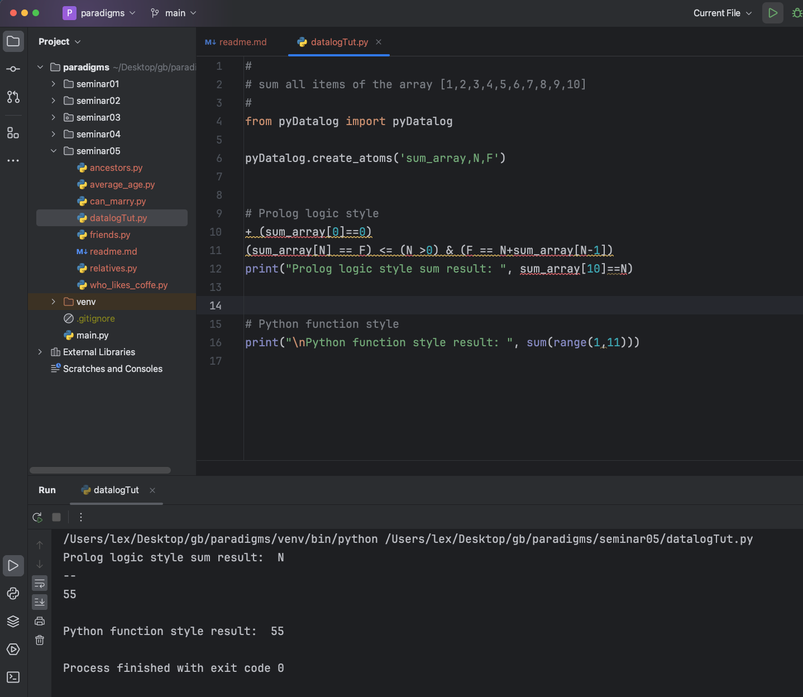

# Урок 5. Логическое программирование

## Installation some packages for Prolog's emulation

pip install pyDatalog

pip install 'git+https://github.com/MHordecki/LogPy#egg=logPy' 

## Сумма элементов списка

Написать программу на языке Prolog для вычисления суммы элементов списка. 

На вход подаётся целочисленный массив. На выходе - сумма элементов массива.


Пример на языке Python в функциональной парадигме:
```python
arr=[1,2,3,4,5,6,7,8,9,10]
sum(arr)
```

См. код программы в файле [sum_array.py](./sum_array.py)

Скриншот работы программы на Прологе и на Пайтоне.

